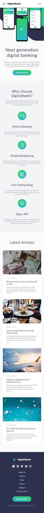

# Frontend Mentor - Digitalbank landing page solution

This is a solution to the [Digitalbank landing page challenge on Frontend Mentor](https://www.frontendmentor.io/challenges/digital-bank-landing-page-WaUhkoDN). Frontend Mentor challenges help you improve your coding skills by building realistic projects.

## Table of contents

- [Frontend Mentor - Digitalbank landing page solution](#frontend-mentor---digitalbank-landing-page-solution)
  - [Table of contents](#table-of-contents)
  - [Overview](#overview)
    - [The challenge](#the-challenge)
    - [Screenshot](#screenshot)
    - [Links](#links)
  - [My process](#my-process)
    - [Built with](#built-with)
    - [What I learned](#what-i-learned)
    - [Continued development](#continued-development)
    - [Useful resources](#useful-resources)
  - [Author](#author)

## Overview

### The challenge

Users should be able to:

- View the optimal layout for the site depending on their device's screen size
- See hover states for all interactive elements on the page

### Screenshot

### Links

- Solution URL: [GitHub](https://github.com/juanhastier/digitalbank-landing-page)
- Live Site URL: [Digitalbank landing page](https://juanhastier.github.io/digitalbank-landing-page)

## My process

### Built with

- Semantic HTML5 markup
- CSS custom properties
- Flexbox
- CSS Grid
- Mobile-first workflow
- Media Querys

### What I learned

This has been the most difficult challenge I have faced in Frontend Mentor, and although I didn't cover any new topics, this challenge helped me apply everything I've learned.

### Continued development

For now, I would like to continue my learning path at Frontend Mentor and thus solve increasingly complex challenges.

### Useful resources

- [MDN](https://developer.mozilla.org/) - I really enjoyed studying on MDN, and I will continue to use it in the future.
- [CSS Tricks: CSS Flexbox Layout Guide](https://css-tricks.com/snippets/css/a-guide-to-flexbox/) - This is an amazing article which helped me finally understand flexbox layout. I'd recommend it to anyone still learning this concept.
- [CSS Tricks: CSS Grid Layout Guide](https://css-tricks.com/complete-guide-css-grid-layout/) - This is an amazing article which helped me finally understand grid layout. I'd recommend it to anyone still learning this concept.

## Author

- Frontend Mentor - [@juanhastier](https://www.frontendmentor.io/profile/juanhastier)